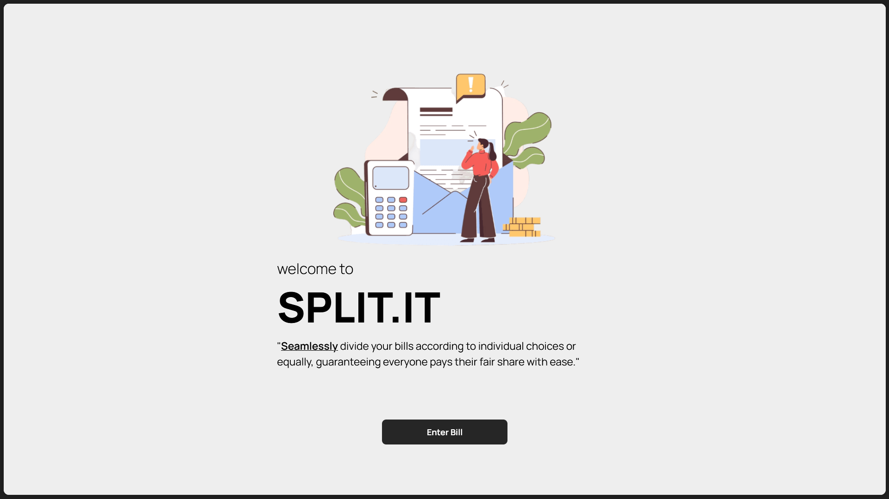
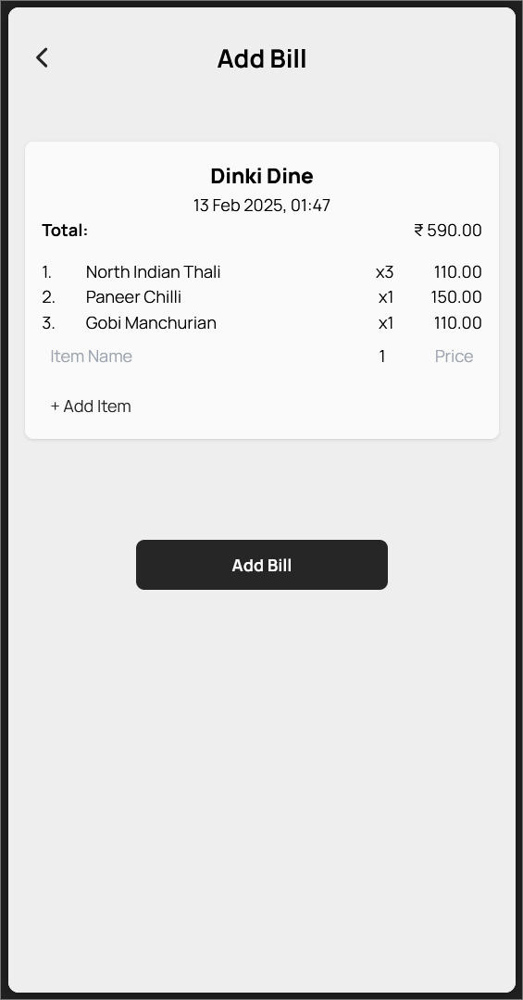
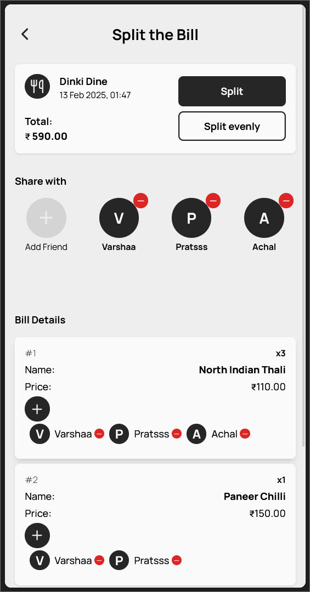
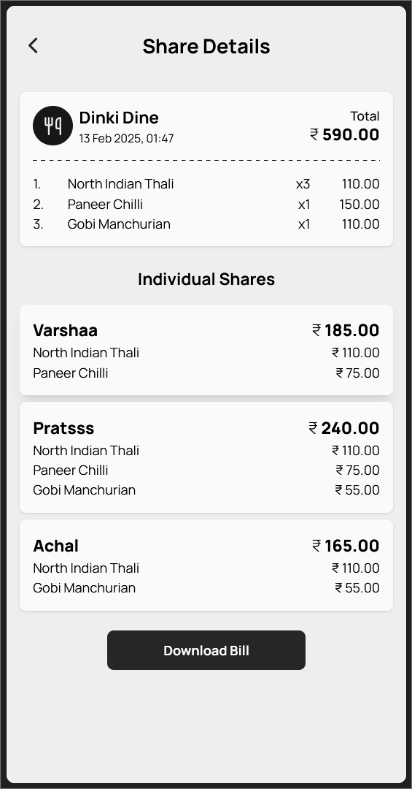

<div align="center">
  
</div>

## About

**SPLIT.IT** is a browser-based bill-splitting app that lets users easily divide expenses, track **shared costs**, and download bill summaries—ensuring fair payment distribution for groups. ⚖️💸

<div align="center" alt="Mobile Mockups" style="display: grid; grid-template-columns: repeat(3, 1fr);">
  
  
  
</div>


## Installation

Clone the Repository & navigate into the directory

```bash
git clone https://github.com/siliconvolley/split-it-web.git
cd split-it-web
```

Use Docker to build the container

```bash
docker compose up
```

### OR

Install dependencies

```bash
npm install
```

Run the application

```bash
npm run dev
```
